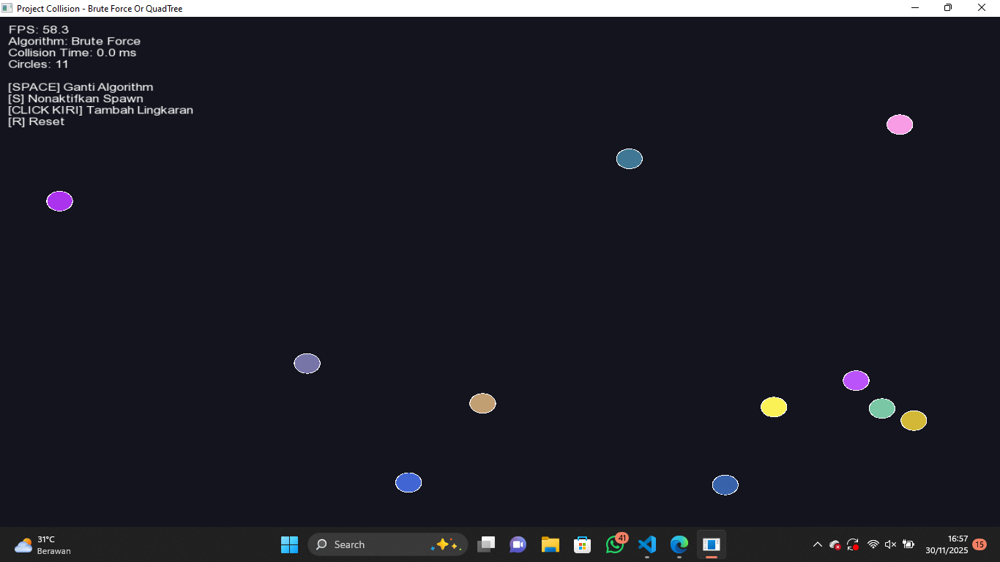
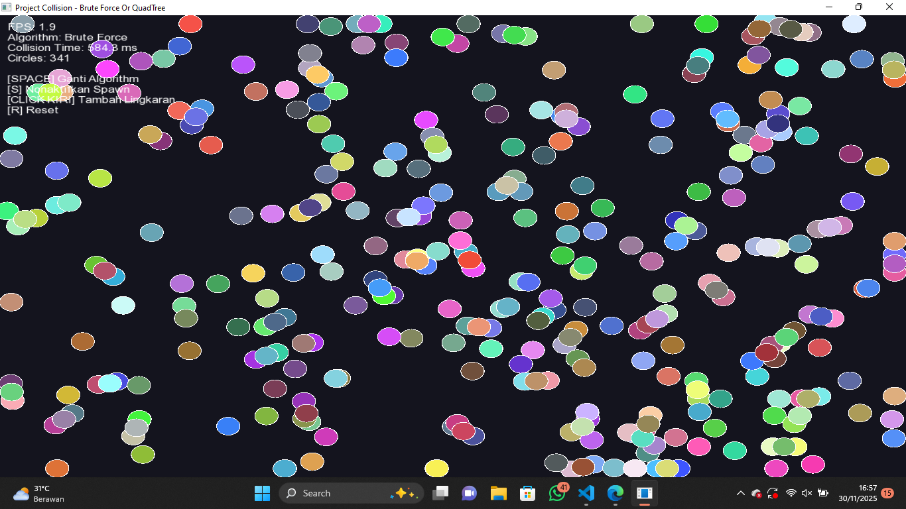
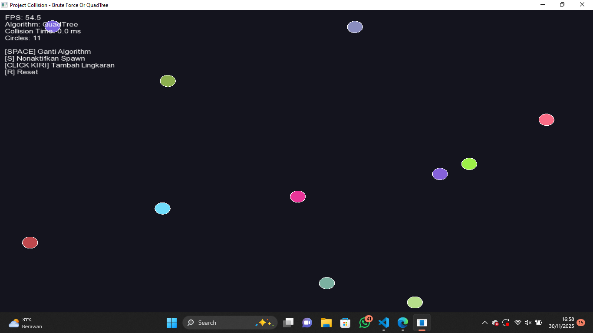
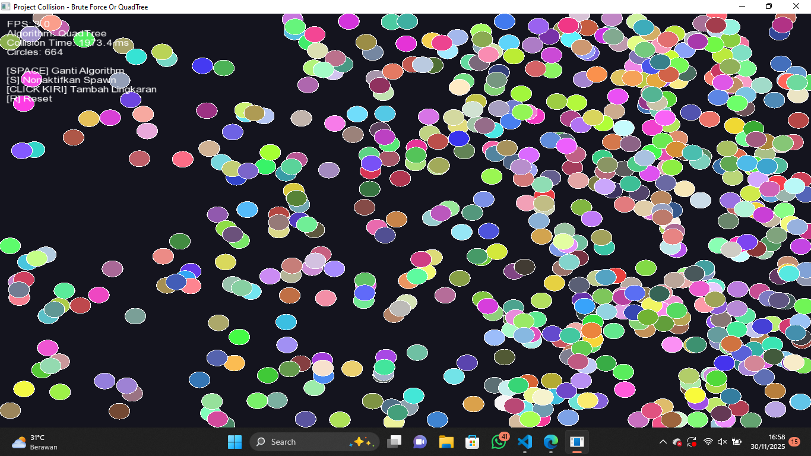
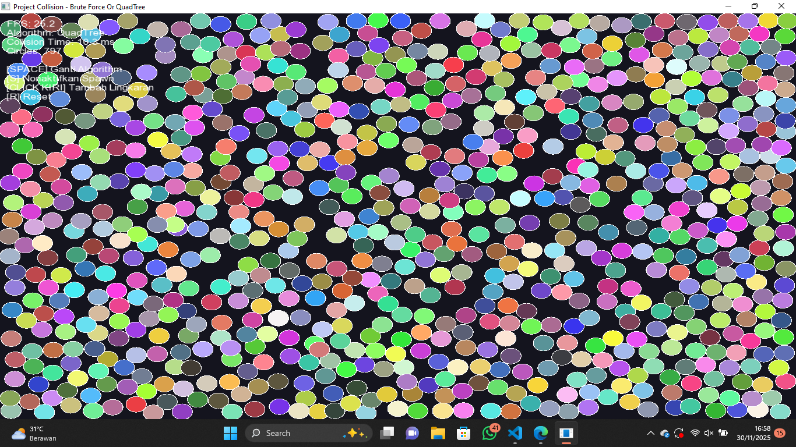

# Project-collision 

# Deskripsi Proyek

Proyek ini adalah simulasi collision yang dibuat menggunakan C++ dan library SFML (Simple and Fast Multimedia Library). Program ini dibuat untuk membandingkan dua algoritma deteksi collision : Brute Force dan QuadTree untuk menunjukkan perbedaan performa jumlah objek yang banyak.

# Fitur Utama

1. Simulasi collition 
2. Dua algoritma collision detection
3. Spawn otomatis lingkaran baru saat terjadi collision
4. Real-time performance 
5. Warna yang berubah-ubah untuk setiap lingkaran yang terbuat.

# Tahap Pengerjaan

1. Persiapan Struktur Folder dan File
Langkah Pembuatan Folder Proyek :
- Buat folder utama PROJECT COLLISION
- Buat subfolder: build, include, src
- Buat file-file header di folder include/
- Buat main.cpp di folder src/
- Buat compile.bat untuk memudahkan kompilasi

2. Tahap Implementasi Logika Program

A. Class Vec2 (Vec2.h)
Fungsi dari class Vec 2 adalah untuk merepresentasikan Vektor 2D dan operasi matematika dasar, untuk fitur yang diimplementasikan sebagai berikut : 
- Konstruktor untuk inisialisasi koordinat x dan y
- Operator overloading (+, -, *, /, +=, -=)
- Method length() untuk menghitung panjang vektor
- Method normalize() untuk normalisasi vektor
- Method dot() untuk dot product
- Static method distance() untuk menghitung jarak antar titik

B. Class Circle (Circle.h)
Fungsi class Circle berguna untuk merepresentasikan objek lingkaran dengan fisika

Properti:
- position          : Posisi lingkaran (Vec2)
- velocity          : Kecepatan lingkaran (Vec2)
- radius            : Jari-jari lingkaran
- color             : Warna lingkaran
- mass              : Massa (berdasarkan r²)
- collisionCooldown : Cooldown untuk mencegah spawn berlebihan

Method Penting:
1. update(float dt)
- Update posisi berdasarkan velocity dan delta time
- Untuk mengurangi collision cooldown
2. isColliding(const Circle& other)
- Berfungsi untuk deteksi collision dengan lingkaran lain
- Menggunakan distance antara center < sum of radii
3. resolveCollision(Circle& other)
- Mengimplementasi fisika tumbukan elastis
- Menggunakan conservation of momentum
- Formula impulse: J = -(1 + e) * vrel · n / (1/m1 + 1/m2)
- Separation untuk mencegah overlap
- Return true jika collision berhasil diresolve
4. checkWallCollision(float width, float height)
- Deteksi dan resolve collision dengan dinding
- Membalik velocity saat menabrak dinding
5. draw(sf::RenderWindow& window)
- Render lingkaran ke window SFML

C. Class Rectangle (Rectangle.h)
Berfungsi untuk merepresentasi area rectangular untuk QuadTree

Method Penting:
- contains(Vec2 point)            : Cek apakah point di dalam rectangle
- intersects(Rectangle range)     : Cek intersection dengan rectangle lain
- intersectsCircle(Circle circle) : Cek intersection dengan lingkaran

D. Class QuadTree (QuadTree.h)
class QuadTree berfungsi sebagai struktur data spatial partitioning untuk optimasi collision detection.

Konsep QuadTree:

Properties:
- CAPACITY : Maksimal 4 objek per node sebelum subdivide
- boundary : Area yang dicakup node ini
- circles  : Vector pointer ke lingkaran di node ini
- divided  : Flag untuk mengetahui apakah sudah di-subdivide
- northeast, northwest, southeast, southwest : Child nodes

Method Penting:
1. subdivide()
- Membagi node menjadi 4 quadrant
- Dipanggil saat capacity sudah melebihi semestinya
2. insert(Circle* circle)
- Masukkan lingkaran ke tree
- Rekursif insert ke child jika sudah subdivided
- Return false jika di luar boundary
3. query(Rectangle range, vector<Circle*>& found)
- Cari semua lingkaran dalam range tertentu
- Rekursif query ke child nodes
- Hanya check intersection, skip subtree jika tidak intersect 

Perbedaan Brute Force dan Quadtree
1. Brute Force Method:
Algoritma  : Nested loop O(n²)
Cara kerja : Brute Force akan mengecheck semua pasangan lingkaran
Kelebihan  : Simple, reliable untuk n kecil
Kekurangan : Lambat untuk n besar (>100 objects)

2. QuadTree Method:
-Algoritma  : Spatial partitioning O(n log n)
-Cara kerja :
 1.Build QuadTree dengan semua lingkaran
 2.Untuk setiap lingkaran, QuadTree hanya akan melakukan query nearby objects
 3.Check collision hanya dengan nearby objects
-Kelebihan  : Sangat cepat untuk n besar
-Kekurangan : Overhead untuk n kecil

# CARA RUN 
1. sfml yang digunakan untuk windows
2. MingW terserah 
3. klik compile.bat dan klik run 
5. terminal akan muncul cmd /c "tempat menyimpan file"
6. jika compilation succes, lanjutkan ke cd build
7. jalan kan dengan .\collision

# Tampilan 
1. Brute Force 

2. QuadTree 

